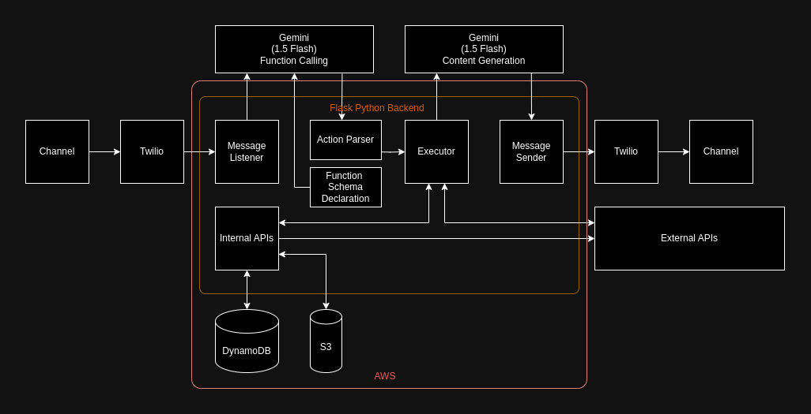

# Architecture Description

This document outlines the architecture of "Dra. Jô," an AI-powered chatbot designed to enhance Solubio's customer service experience.

### System Overview

Dra. Jô is a multi-functional chatbot that leverages natural language processing (NLP) and API integrations to provide a seamless and efficient user experience. The system is built on a Flask Python backend hosted on AWS and interacts with users primarily through the WhatsApp channel.

### Key Components

1. **Channel (WhatsApp):** The primary communication channel for user interactions.
2. **Twilio:**  A service used to manage the flow of messages between the chatbot and the WhatsApp channel. It acts as the bridge, allowing the system to send and receive messages over WhatsApp.
3. **Gemini Flash (FC):**  Triggered by an incoming message on the WhatsApp channel, this component initiates the chatbot's workflow.
4. **Action Parser:**  Processes the data received from "Gemini Flash (FC)" to extract the necessary information and format it into a set of arguments (function-args) that can be passed to the "Executor" for function execution.
5. **Function Schema Declaration:**   Defines the structure and format of the arguments that each function in the integration expects. This ensures that the "Executor" can correctly call the right function with the appropriate data. This schema acts as a guide for Gemini to detect intents.
6. **Executor:** Executes the function selected based on the user's intent, carrying out the necessary actions.
7. **Data Storage (DynamoDB and S3):** 
    * **DynamoDB:**  Used for storing and retrieving structured data, such as user information, past interactions, and configuration settings.
    * **S3:** Used for storing files, images, videos, and other media assets that might be needed for responses or analysis.
8. **Internal APIs:**  These are APIs that provide specific functionalities within the chatbot itself, such as:
    * **Chat Closing Timers:**  Implement timers to close conversations automatically if there is no user response after a certain period.
    * **Authentication Hooks:** Handle user authentication and authorization processes.
    * **Other Internal Mechanisms:**  Provide other functionalities or behaviors needed for the chatbot's operation.
9. **External APIs:** The system interacts with external APIs to access specific functionality. Examples could include:
    * **Payment APIs:**  For processing payments or financial transactions.
    * **Event Management APIs:**  For scheduling appointments or managing events.
    * **Other External Services:**  For accessing data or services from other systems.
10. **Gemini Flash (CG):**  Generates a tailored response based on the action's results, the user's context, and the identified intent.
11. **Response Sender:**  Sends the generated response to the user through the WhatsApp channel using Twilio.

### Data Flow

1. **Message Reception:**  A user sends a message through WhatsApp.
2. **Trigger:**  The message triggers the "Message Listener" component, initiating the processing workflow.
3. **Intent Understanding:**  The "Gemini FC" analyzes the message to determine the user's intent.
4. **Action Parsing:** it takes the output from "Gemini FC" (which includes the identified intent and possibly some extracted data) and formats it into a set of arguments (function-args) that can be passed to the "Executor" for function execution.
5. **Function Execution:** The "Executor" runs the appropriate function, potentially interacting with data stored in DynamoDB or S3 and using external or internal APIs.
6. **Response Generation:** The "Gemini Flash (CG)" component creates a dynamic response tailored to the user's intent and context.
7. **Message Delivery:** The "Response Sender" sends the generated response to the user via WhatsApp using Twilio.
8. **Data Logging:** Throughout the interaction, message details, user information, actions taken, and responses are logged for analysis and future improvement.

### Technology Stack

* **Backend:**  Flask (Python), Docker
* **Cloud:** AWS (Amazon Web Services)
* **Storage:** DynamoDB, S3
* **Communication:** Twilio (for WhatsApp integration)
* **Natural Language Processing (NLP):**  Gemini 1.5 Flash

### Key Considerations

* **User Intent:** The system needs to accurately identify user intents to provide relevant responses. This system does not inherently possess intents like "persuading" but instead focuses on understanding and addressing the user's specific needs.
* **Dynamic Response Generation:**  The system should generate responses tailored to individual users and their specific needs.
* **Data Logging:**  The system must record interaction data for analysis, optimization, and future development.
* **Scalability:** The system should be able to handle a growing number of user interactions and expanding functionality.

This document provides a high-level overview of the "Dra. Jô" system. Further documentation and details can be found in the `docs` directory of the repository. 
